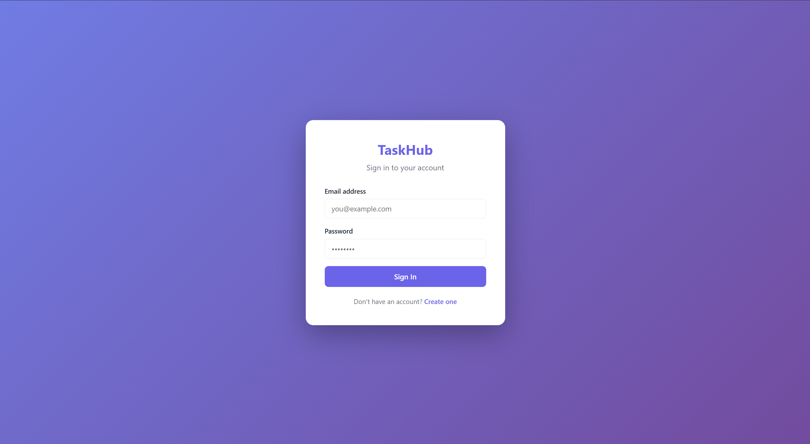
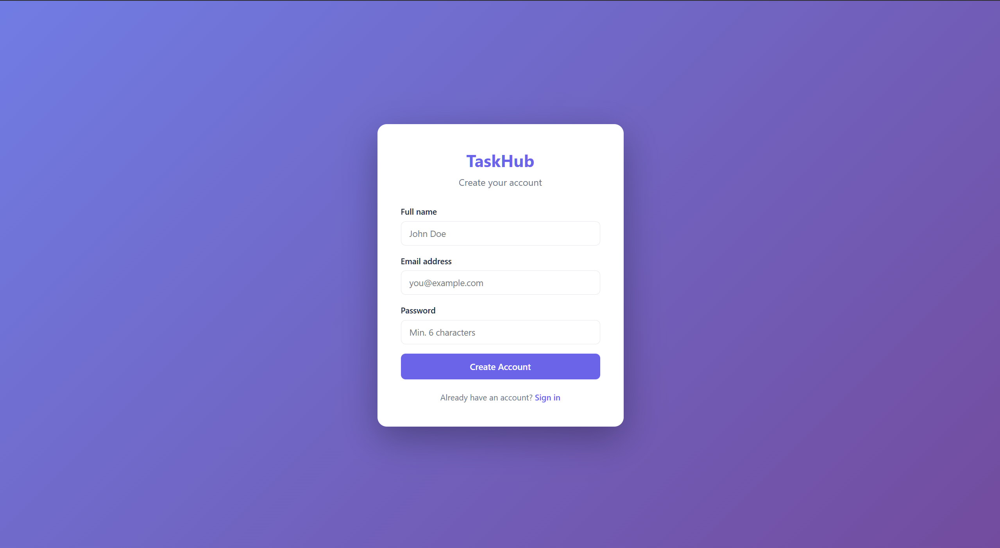
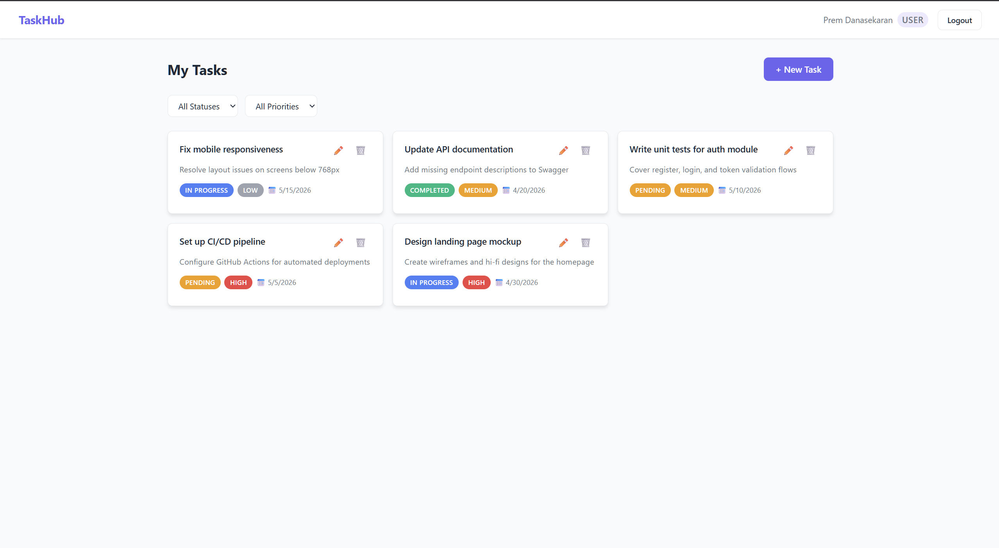
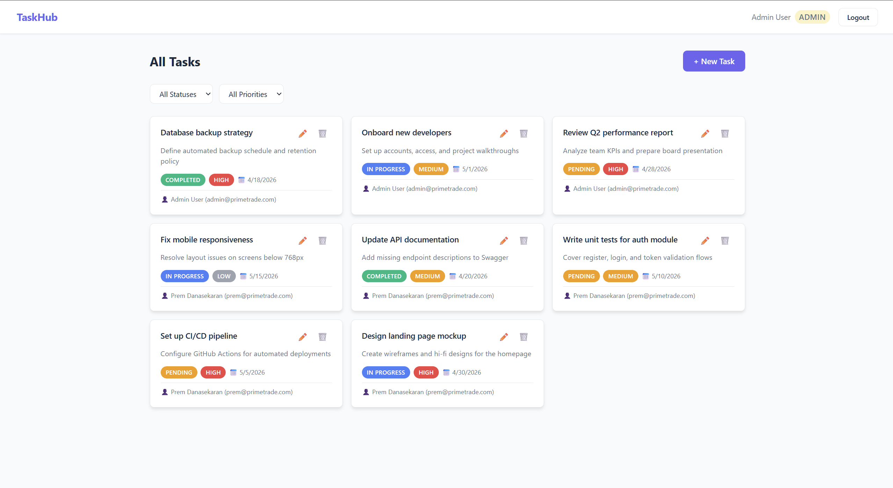
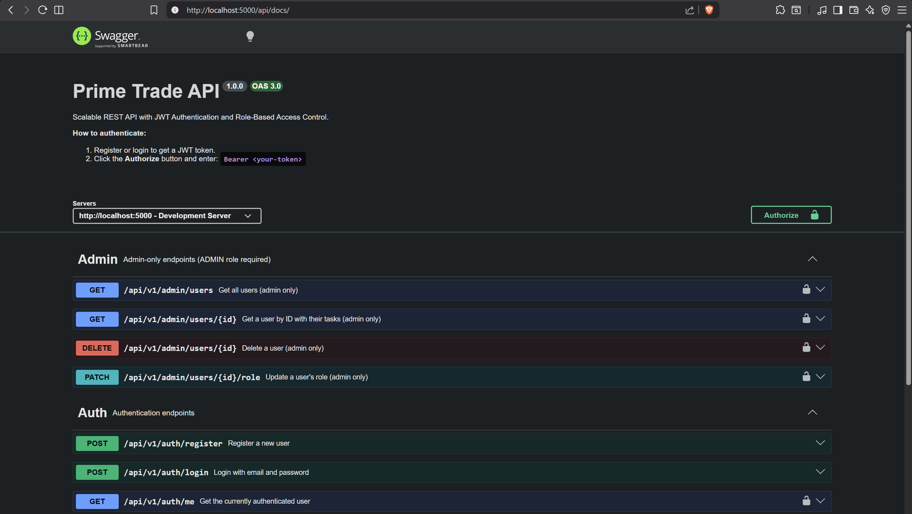
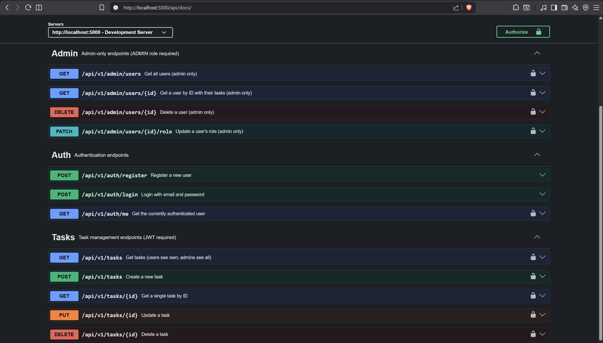

# TaskHub – Task Manager API

A scalable REST API with JWT authentication, role-based access control, and a React frontend.

## Screenshots

### Login & Register
<p align="center">
  
  
</p>

### User Dashboard
<p align="center">
  
</p>

### Admin Dashboard (all users' tasks)
<p align="center">
  
</p>

### Swagger API Documentation
<p align="center">
  
  
</p>

---

## Tech Stack

| Layer     | Technology                              |
|-----------|-----------------------------------------|
| Backend   | Node.js, Express.js                     |
| Database  | PostgreSQL (Supabase) via Prisma ORM    |
| Auth      | JWT + bcrypt                            |
| Validation| express-validator                       |
| Docs      | Swagger (OpenAPI 3.0)                   |
| Frontend  | React 18 + Vite                         |

## Features

- **User Auth** – Register, login, JWT token issuance
- **Role-Based Access** – `USER` and `ADMIN` roles
- **Task CRUD** – Create, read, update, delete tasks with filters and pagination
- **Admin Panel** – View all users, change roles, delete users
- **Swagger Docs** – Interactive API documentation at `/api/docs`
- **Input Validation** – All inputs validated and sanitized server-side
- **Secure** – Helmet, CORS, hashed passwords, JWT verification

---

## Getting Started

### Prerequisites

- Node.js v18+
- A Supabase project (or any PostgreSQL database)

### 1. Clone the repo

```bash
git clone https://github.com/Black-Hawk-005/prime-trade-ai-backend-task.git
cd prime-trade-ai-backend-task
```

### 2. Setup Backend

```bash
cd backend
npm install
```

Create a `.env` file (copy from `.env.example`):

```env
DATABASE_URL="postgresql://postgres:<password>@db.<ref>.supabase.co:5432/postgres?sslmode=require"
JWT_SECRET="your-super-secret-key"
JWT_EXPIRES_IN="7d"
PORT=5000
NODE_ENV=development
FRONTEND_URL="http://localhost:3000"
```

Run database migrations:

```bash
npx prisma migrate dev --name init
```

Seed the database (creates an admin user):

```bash
node prisma/seed.js
```

> Default admin credentials: `admin@taskhub.com` / `admin123456`

Start the backend:

```bash
npm run dev
```

Backend runs at: `http://localhost:5000`

### 3. Setup Frontend

```bash
cd ../frontend
npm install
npm run dev
```

Frontend runs at: `http://localhost:3000`

---

## API Endpoints

### Auth – `/api/v1/auth`

| Method | Endpoint    | Auth     | Description             |
|--------|-------------|----------|-------------------------|
| POST   | `/register` | Public   | Register a new user     |
| POST   | `/login`    | Public   | Login, receive JWT      |
| GET    | `/me`       | JWT      | Get current user        |

### Tasks – `/api/v1/tasks`

| Method | Endpoint  | Auth        | Description                           |
|--------|-----------|-------------|---------------------------------------|
| GET    | `/`       | JWT         | Get tasks (user: own; admin: all)     |
| POST   | `/`       | JWT         | Create a new task                     |
| GET    | `/:id`    | JWT         | Get task by ID                        |
| PUT    | `/:id`    | JWT         | Update task                           |
| DELETE | `/:id`    | JWT         | Delete task                           |

**Query params for GET `/`:** `status`, `priority`, `page`, `limit`

### Admin – `/api/v1/admin` *(ADMIN role required)*

| Method | Endpoint             | Description                |
|--------|----------------------|----------------------------|
| GET    | `/users`             | List all users             |
| GET    | `/users/:id`         | Get user with their tasks  |
| PATCH  | `/users/:id/role`    | Update user role           |
| DELETE | `/users/:id`         | Delete a user              |

---

## API Documentation

Swagger UI is available at: **`http://localhost:5000/api/docs`**

1. Register or login to get a JWT token
2. Click **Authorize** in Swagger UI
3. Enter: `Bearer <your-token>`

---

## Database Schema

```
User
├── id         UUID (PK)
├── name       String
├── email      String (unique)
├── password   String (bcrypt hashed)
├── role       Enum: USER | ADMIN
├── createdAt  DateTime
└── updatedAt  DateTime

Task
├── id          UUID (PK)
├── title       String
├── description String?
├── status      Enum: PENDING | IN_PROGRESS | COMPLETED
├── priority    Enum: LOW | MEDIUM | HIGH
├── dueDate     DateTime?
├── userId      UUID (FK → User)
├── createdAt   DateTime
└── updatedAt   DateTime
```

---

## Security Practices

- **Passwords** hashed with bcrypt (cost factor 12)
- **JWT** signed with HS256, expires in 7 days
- **Helmet** sets secure HTTP headers
- **CORS** restricted to frontend origin
- **Input sanitization** via express-validator on all endpoints
- **Role enforcement** via middleware before every protected route
- Admin cannot delete or change their own role